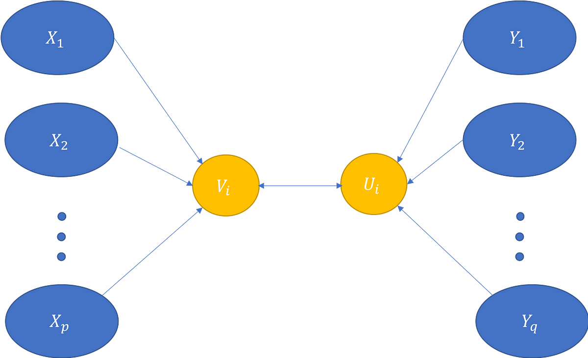

# Canonical Correlation Analysis (CCA)

CCA aims to find linear combinations of two sets of variables, $X$ and $Y$, such that the correlation between these combinations is maximized.

Given:
- $X \in \mathbb{R}^{n \times p}$: Matrix with $n$ samples and $p$ features.
- $Y \in \mathbb{R}^{n \times q}$: Matrix with $n$ samples and $q$ features.

We want to find weight vectors $a \in \mathbb{R}^{p}$ and $b \in \mathbb{R}^{q}$ such that the correlation between $X a$ and $Y b$ is maximized.

### Steps and Equations

1. **Center the Data:**
   Centering the data involves subtracting the mean of each variable:
   $$
   \tilde{X} = X - \frac{1}{n} \mathbf{1} \mathbf{1}^T X
   $$
   $$
   \tilde{Y} = Y - \frac{1}{n} \mathbf{1} \mathbf{1}^T Y
   $$
   Here, $\mathbf{1}$ is an $n \times 1$ vector of ones.

2. **Covariance Matrices:**
   Compute the covariance matrices:
   $$
   \Sigma_{XX} = \frac{1}{n-1} \tilde{X}^T \tilde{X}
   $$
   $$
   \Sigma_{YY} = \frac{1}{n-1} \tilde{Y}^T \tilde{Y}
   $$
   $$
   \Sigma_{XY} = \frac{1}{n-1} \tilde{X}^T \tilde{Y}
   $$

3. **Inverse Square Root Matrices:**
   Compute the inverse square roots of the covariance matrices $\Sigma_{XX}$ and $\Sigma_{YY}$:
   $$
   \Sigma_{XX}^{-1/2} = V_X \Lambda_X^{-1/2} V_X^T
   $$
   $$
   \Sigma_{YY}^{-1/2} = V_Y \Lambda_Y^{-1/2} V_Y^T
   $$
   where $\Lambda_X$ and $\Lambda_Y$ are diagonal matrices of eigenvalues, and $V_X$ and $V_Y$ are matrices of eigenvectors of $\Sigma_{XX}$ and $\Sigma_{YY}$, respectively.

4. **Transformation Matrix:**
   Form the transformation matrix $T$:
   $$
   T = \Sigma_{XX}^{-1/2} \Sigma_{XY} \Sigma_{YY}^{-1/2}
   $$

5. **Singular Value Decomposition (SVD):**
   Perform SVD on the transformation matrix $T$:
   $$
   T = U \Sigma V^T
   $$
   Here, $U$ and $V$ are orthogonal matrices, and $\Sigma$ is a diagonal matrix containing the singular values (canonical correlations).

6. **Canonical Correlations and Weights:**
   The singular values $\sigma_i$ in $\Sigma$ are the canonical correlations. The columns of $U$ and $V$ are the canonical weights:
   $$
   a_i = \Sigma_{XX}^{-1/2} u_i
   $$
   $$
   b_i = \Sigma_{YY}^{-1/2} v_i
   $$
   where $u_i$ and $v_i$ are the $i$-th columns of $U$ and $V$, respectively.

7. **Canonical Components:**
   The canonical components (projections) are:
   $$
   X_c = \tilde{X} \Sigma_{XX}^{-1/2} U
   $$
   $$
   Y_c = \tilde{Y} \Sigma_{YY}^{-1/2} V
   $$

### Theory Behind the Maximization

The goal of CCA is to find vectors $a$ and $b$ that maximize the correlation (this based on [wiki post](https://en.wikipedia.org/wiki/Canonical_correlation)):
$$
\rho = \max_{a, b} \frac{a^T \Sigma_{XY} b}{\sqrt{a^T \Sigma_{XX} a \cdot b^T \Sigma_{YY} b}}
$$

This is equivalent to solving the following constrained optimization problem:
$$
\max_{a, b} a^T \Sigma_{XY} b \quad \text{subject to} \quad a^T \Sigma_{XX} a = 1 \quad \text{and} \quad b^T \Sigma_{YY} b = 1
$$

**Solution using SVD:**

1. **Standardization:** By transforming $X$ and $Y$ using the inverse square roots of their covariance matrices, we standardize the variables:
   $$
   \hat{X} = \tilde{X} \Sigma_{XX}^{-1/2}
   $$
   $$
   \hat{Y} = \tilde{Y} \Sigma_{YY}^{-1/2}
   $$

2. **Optimization:** The transformation matrix $T$ encapsulates the relationship between the standardized variables:
   $$
   T = \Sigma_{XX}^{-1/2} \Sigma_{XY} \Sigma_{YY}^{-1/2}
   $$
   Performing SVD on $T$ provides the optimal directions (canonical weights) and the strengths of the correlations (canonical correlations).

By transforming the covariance matrices and performing SVD, we efficiently find the directions (weights) that maximize the correlation between the linear combinations of $X$ and $Y$. The singular values obtained from the SVD are the canonical correlations, which are the maximum correlations between the projections. This method leverages the properties of SVD to solve the constrained optimization problem inherent in CCA.